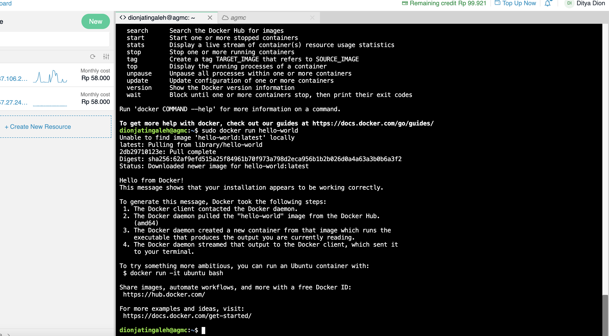
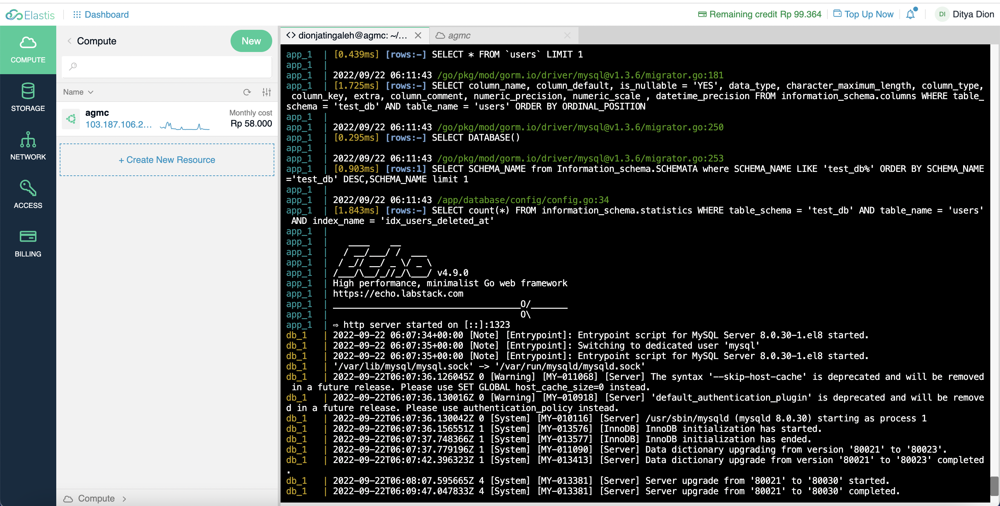

## Docker image

```bash
https://hub.docker.com/repository/docker/dionjatingaleh/agmc-day7
```

## Getting started

```bash
make build
make run
```

## Integration tests

```bash
make test
```

## Production build

```bash
make build-prod
make run:prod
```


# Deployment process

1. Install docker & docker compose

Reference:
https://docs.docker.com/engine/install/ubuntu/

https://www.digitalocean.com/community/tutorials/how-to-install-and-use-docker-compose-on-ubuntu-20-04



1. Install make

Reference: 
https://linuxhint.com/install-make-ubuntu/

1. Clone the repository


```bash
git clone https://github.com/dionaditya/agmc-alterra
```


3. run deploy command

```bash
make build-prod
make run-prod
```




4. test using postman


